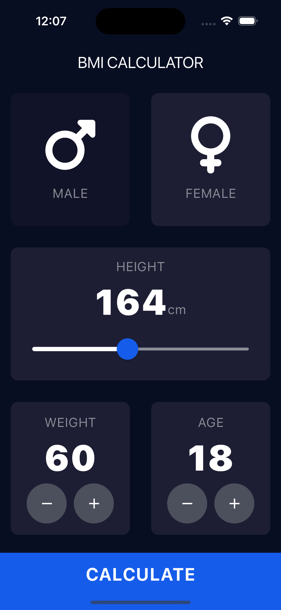

# BMI Calculator
A Body Mass Index (BMI) Calculator created with Flutter.

## Overview
This BMI Calculator allows users to calculate their BMI based on their weight and height inputs. It provides an easy-to-use interface where users can select their gender, enter their height in centimeters, and specify their weight. The app then calculates the BMI and provides a result, indicating whether the user is underweight, normal weight, overweight, or obese.

## Features
- Gender selection (Male/Female)
- Height input in centimeters
- Weight input
- BMI calculation
- Result interpretation
- Easy-to-use interface

## Screenshots


## Packages Used
Font Awesome Flutter: Provides access to thousands of icons that can be used within the app.
rflutter_alert: Allows displaying custom alert dialogs with various configurations.

## Installation
To run the BMI Calculator app locally, follow these steps:

1. Clone this repository to your local machine.
```bash
git clone https://github.com/macbrina/bmi_calculator_flutter.git
```
2. Navigate to the project directory.
```bash
cd bmi_calculator_flutter
```
3. Run flutter pub get to install the required dependencies.
4. Run flutter run to launch the app on your device or emulator.

## Usage
1. Select your gender
2. Use the slider to select your height.
3. Use the buttons to select your weight and age.
4. Tap on the "Calculate" button to see results.

## Contributing
Contributions are welcome! Feel free to open an issue or submit a pull request for any improvements or features you'd like to add.

## License
This project is licensed under the MIT License - see the [LICENSE](LICENSE) file for details.
